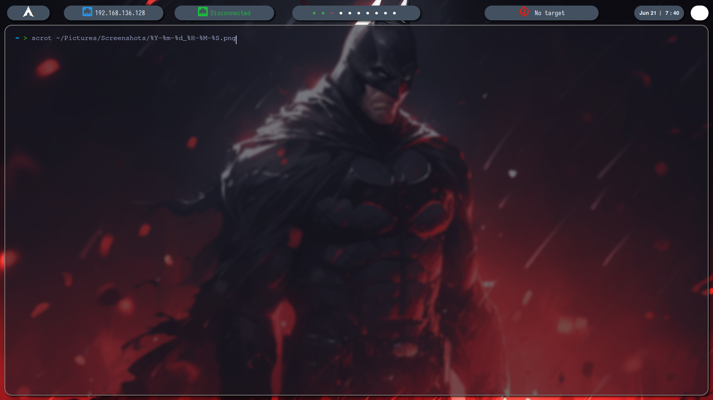
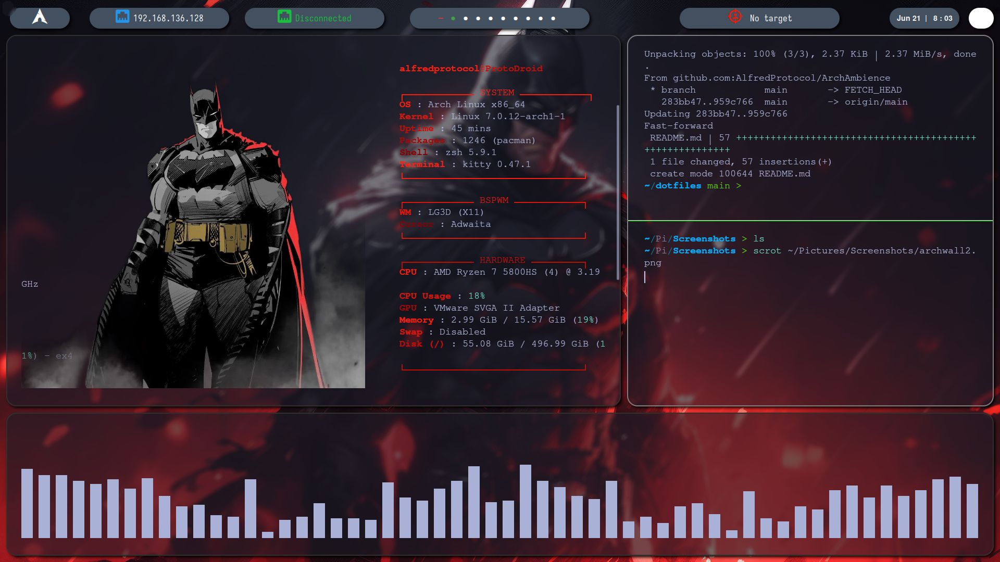

<div align="center">

  
  
  
  
  
  

  <br />
  <br />

  

  ## ArchAmbience

  An awesome README template to jumpstart your projects!
  
  **[Explore the docs »](https://github.com/AlfredProtocol/ArchAmbience)**

  [View Demo](https://github.com/AlfredProtocol/ArchAmbience) · [Report Bug](https://github.com/AlfredProtocol/ArchAmbience/issues) · [Request Feature](https://github.com/AlfredProtocol/ArchAmbience/issues)

</div>

<br />

<details>
  <summary>Table of Contents</summary>
  <ol>
    <li><a href="#about-the-project">About The Project</a></li>
    <li><a href="#getting-started">Getting Started</a></li>
    <li><a href="#usage">Usage</a></li>
  </ol>
</details>

## 🛡️ About The Project

**ArchAmbience** es un entorno de trabajo e investigación de ciberseguridad minimalista, altamente optimizado y estéticamente personalizado bajo una temática táctica (*Dark/Batman Mode*). Este repositorio almacena mis archivos de configuración (*dotfiles*) para replicar de forma idéntica un sistema operativo enfocado en el hacking ético y el desarrollo eficiente.

A diferencia de los entornos de escritorio pesados y convencionales, este setup utiliza un gestor de ventanas por mosaico (**Tiling Window Manager**) que maximiza el rendimiento del hardware y la velocidad del operador mediante el uso exclusivo del teclado.

### 🧰 Built With / Core Components

El ecosistema de este entorno está construido utilizando herramientas clave de la comunidad de código abierto:

* **Window Manager:** `bspwm` (Gestión de ventanas por mosaico basada en espacio binario)
* **Hotkeys:** `sxhkd` (Demonio de atajos de teclado independiente y de baja latencia)
* **Terminal:** `kitty` (Emulador de terminal hiperrápido renderizado por GPU con soporte de imágenes nativo)
* **Status Bar:** `polybar` (Barra de estado modular, informativa y altamente personalizable)
* **Compositor:** `picom` (Efectos visuales, transparencias difuminadas y sombras)
* **App Launcher:** `rofi` (Lanzador de aplicaciones táctico y menú de búsqueda dinámica)
* **Text Editor:** `neovim` (Entorno de desarrollo y edición de scripts optimizado desde consola)
* **Shell:** `zsh` / `bash` (Entornos de comandos interactivos y automatización)

### Here some images about the project

* <div align="center">
  
</div>

* <div align="center">
  
</div>

## 🚀 Getting Started & Installation

Follow these steps carefully to deploy this environment on a clean Arch Linux installation without breaking the session on startup.

### 📋 Prerequisites & Dependencies

Before copying the configuration files to your `~/.config/` directory, you **must** install all the base binaries and components. Missing these will result in a black screen upon login.

Run the following command to install the complete ecosystem:
```bash
sudo pacman -S --needed bspwm sxhkd kitty fastfetch picom polybar rofi neovim zsh bash feh xorg-xrandr

font-awesome 📦 Fonts & Icons
This setup relies on specific glyphs for polybar and rofi. Installing it without the proper typography will cause missing icons (empty squares). Install the complete Nerd Fonts package:

Bash
sudo pacman -S ttf-nerd-fonts-symbols-common ttf-jetbrains-mono-nerd
⚙️ Deployment & Setup
1. Clone and Copy Configurations
Clone this repository and sync the dotfiles into your local system:

Bash
git clone [https://github.com/AlfredProtocol/ArchAmbience.git](https://github.com/AlfredProtocol/ArchAmbience.git)
cd ArchAmbience
# Copying config directories to your local ~/.config
cp -r bspwm fastfetch kitty nvim picom polybar rofi sxhkd ~/.config/
# Copying shell environments
cp .bashrc .zshrc ~/
2. Make Scripts Executable (Crucial)
Startup scripts require execution permissions to launch the environment and modules correctly. Grant permissions using:

Bash
chmod +x ~/.config/bspwm/bspwmrc
chmod +x ~/.config/polybar/launch.sh
chmod +x ~/ArchAmbience/install.sh
3. Configure Session Startup
bspwm does not start automatically like heavy desktop environments (GNOME/KDE). Choose your preferred login method:

Using a Display Manager (SDDM / LightDM): No extra steps needed. They will automatically detect bspwm as an available session on your login screen.

Using Boot from Console (startx): Append the following execution line to the very end of your ~/.xinitrc file:

Bash
exec bspwm
⚠️ Important Notes for Users
Path Normalization: The current bspwmrc file contains static paths for the background wallpaper pointing to a custom directory. If your username is not alfredprotocol, make sure to edit ~/.config/bspwm/bspwmrc and adjust the path using the global ~/ variable to match your own setup.
